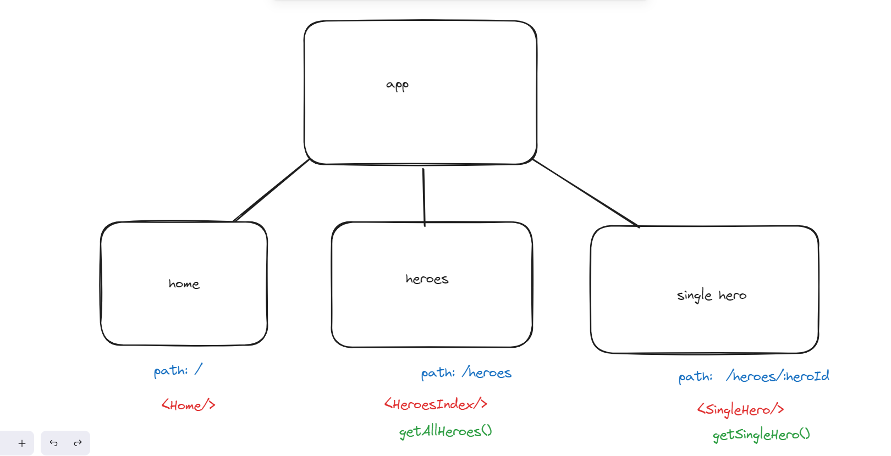
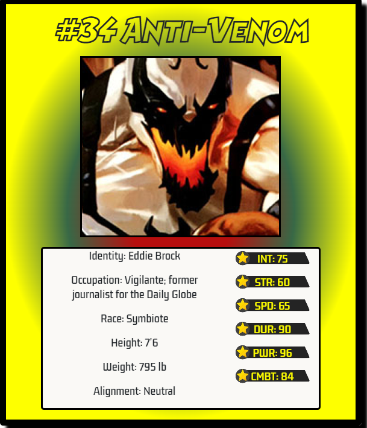
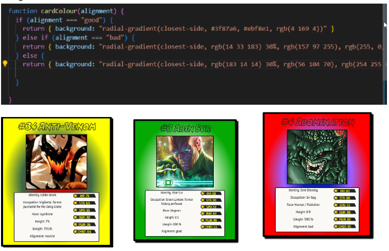

# SuperHero Search ReadMe

## Overview and Concept

This project is an app called SuperHero Search, utilizing an API to retrieve information on 731 heroes and villains. Developed over two days in collaboration, the project involved writing code together while overcoming challenges and brainstorming solutions.

Site’s link: [SuperHero Search](https://superherosearch.netlify.app/)

## Technologies Used:

- **SCSS:** Styling app and implementing turn page transition.
- **React:** Creating pages for the app, rendering HTML, and utilizing Bootstrap for navbar modals.
- **JavaScript:** Creating functions to retrieve information from API endpoints.
- **Insomnia:** Checking the API’s endpoints.

## Installation:

1. Clone the repository: `git clone git@github.com:Jerrellbb/Super-Heroes-Search.git`
2. Install dependencies using your preferred package manager: `npm install`
3. Start the development server: `npm run dev`

## Technical Requirements:

Your application is required to consume a public API, ensuring its relevance to the project's purpose. It should be composed of multiple components, offering modularity and a structured architecture. Consider implementing a router with distinct "pages" if it aligns with your project's logic and enhances user experience. Prior to development, provide wireframes that you designed, serving as a visual guide and blueprint for the application's major views and interfaces. This step ensures a thoughtful and well-planned approach to the design and layout of your app.

## The Approach Taken

### Day 1:

On the first day, my partner and I made a choice of which API we were going to use, this was the superhero API. Once we found an api we created our wireframe to give us a rough idea of what pages, paths and loaders we were going to use.

Once the wireframe was done we began creating each page using React to render the HTML. We then got started on our navbar to allow users to navigate the frontend. For the navbar, we opted for a fullscreen modal using Bootstrap, aiming to provide users with an immersive and thematic frontend experience.

Once the paths for navigation were finished, we focused on the end points from the API we used. We used the end point for getting all heroes and villains to allow us to create a loader that  displays an index of all heroes and villains on our heroes component.

After displaying all heroes and villains we made a start on our next component which was to use each hero and villain from the index as a link. To a component that displays the specific hero or villain, when the user selects a hero or villain the  information on said selection will be shown in a page in the style of a Top Trumps card.

### Day 2:

On day 2, once we had the main things that we wanted to display up and running how we liked, we focused on styling. First, we decided to find different fonts that could give our front more of a comic book aesthetic. We also created some logic that gave each card a colour depending on what their alignment was out of good, bad or neutral.

We then added an image to our landing page and a gif as a spinner while loading content between components, to further immerse users in the comic book ambiance. We integrated an innovative page-turning image that served as a trigger for opening the modal navbar, adding a delightful touch to the overall user experience. This attention to styling details solidified the unique and captivating visual identity of our superhero-themed application.

## Key Learnings:

- Gained understanding of working with APIs and utilising endpoints.

## Wins:

- Successfully finding the right API that aligned with project requirements.

## Challenges:

- Finding an API without request limitations.
- Completing all desired features within the time frame.

## Future Improvements:

- Implementing a Top Trump style battle component against an AI using chosen cards.

## Bugs:

- No bugs detected during testing.
